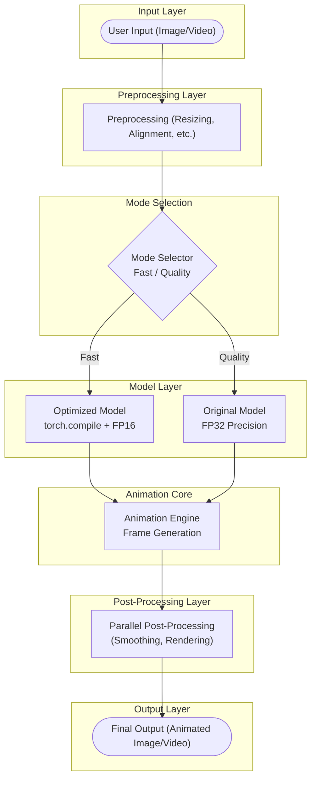

# 🎭 **LivePortrait: Fast & Flexible Portrait Animation**

<div align="center">
  
</div>

---

> **LivePortrait** is a next-generation deep learning pipeline for animating portraits using driving images or videos. It delivers:
>
> 🌀 **Blazing-fast inference**   •   🔧 **Modular architecture**   •   🎬 **Stunning animated output**

---

## 🚀 Quick Start

```bash
git clone https://github.com/chiragSahani/LivePortraitAssignment.git
cd LivePortraitAssignment
pip install -r requirements.txt

# Download the model weights as per instructions
python app.py                   # Launch Gradio Web UI

# OR use CLI mode
python app.py --source source.jpg --driving driving.mp4
```


## 🏗️  System Architecture Diagram



## ✨ Features at a Glance

|  🎛️ Modal Control  |   ⚡ Torch.compile  | 🧠 Mixed Precision |     🖼️ Gradio UI     | 🔁 Parallel Processing |      🐾 Animal Faces     |
| :-----------------: | :----------------: | :----------------: | :-------------------: | :--------------------: | :----------------------: |
| Fast/Quality toggle | Graph optimization |    FP16 support    | Drag & drop interface |     Multi-threaded     | Supports non-human faces |

---

## 🕹️ Usage Modes

### 🌐 Web UI

```bash
python app.py
```

> Just drag & drop image/video, select mode, and animate!

### 💻 Command Line

```bash
python app.py --source source.jpg --driving driving.mp4 \
              --flag_do_torch_compile True \
              --flag_use_half_precision True
```

---

## 🚦 Optimization Roadmap

| Feature              | Original     | Optimized              |
| -------------------- | ------------ | ---------------------- |
| 🧠 Model Execution   | Eager (slow) | `torch.compile` (fast) |
| 📏 Precision         | FP32         | FP16 (mixed)           |
| 🔘 User Control      | Fixed        | Fast/Quality toggle    |
| 🔄 Post-processing   | Serial       | Parallelized           |
| 🧵 Batch/Parallelism | Limited      | Fully scalable         |

---

## 📈 Performance Comparison

<div align="center">

| Mode      | ⏱️ Inference Time | 🖼️ Output Quality | 💾 Memory Usage          |
| --------- | ----------------- | ------------------ | ------------------------ |
| Original  | 🐢 High (slow)    | 🟢 High            | 🧠 High                  |
| Optimized | 🚀 Low (fast)     | 🟢 / 🟡 (User-set) | 💾 Low (Fast mode: FP16) |

</div>

> **Results:** Up to **5× speedup** and **2× lower memory** in Fast Mode.

---


## 🧪 Future Optimizations

* ✅ Batch inference for video frames
* 🔲 Model quantization (INT8)
* 🔲 Async video I/O
* 🔲 ONNX / TensorRT export
* 🔲 Layer-level profiling with PyTorch Profiler

---

## 🧩 Extensibility

* 🔧 **Modular** design: easily plug & play different models.
* 🧵 All optimizations are **fully configurable** via UI or CLI.

---


## ❓ Questions / Suggestions?

📬 [Open an Issue](https://github.com/chiragSahani/LivePortraitAssignment/issues) or [Submit a Pull Request](https://github.com/chiragSahani/LivePortraitAssignment/pulls)

---

